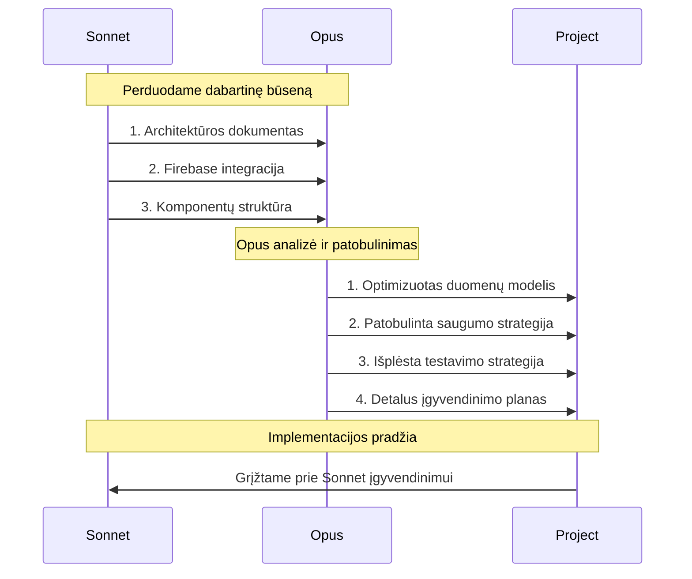
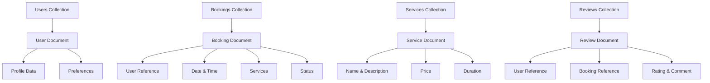
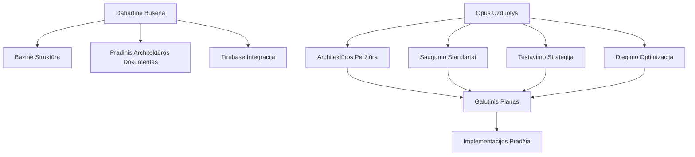

# Project Diagrams

## 1. Process Flow Diagram

```mermaid
sequenceDiagram
    participant S as Sonnet
    participant O as Opus
    participant P as Project

    Note over S,O: Perduodame dabartinę būseną
    S->>O: 1. Architektūros dokumentas
    S->>O: 2. Firebase integracija
    S->>O: 3. Komponentų struktūra
    
    Note over O: Opus analizė ir patobulinimas
    
    O->>P: 1. Optimizuotas duomenų modelis
    O->>P: 2. Patobulinta saugumo strategija
    O->>P: 3. Išplėsta testavimo strategija
    O->>P: 4. Detalus įgyvendinimo planas
    
    Note over S,P: Implementacijos pradžia
    P->>S: Grįžtame prie Sonnet įgyvendinimui
```

## 2. Data Model Diagram

```mermaid
graph TD
    A[Users Collection] --> B[User Document]
    B --> C[Profile Data]
    B --> D[Preferences]
    
    E[Bookings Collection] --> F[Booking Document]
    F --> G[User Reference]
    F --> H[Date & Time]
    F --> I[Services]
    F --> J[Status]
    
    K[Services Collection] --> L[Service Document]
    L --> M[Name & Description]
    L --> N[Price]
    L --> O[Duration]
    
    P[Reviews Collection] --> Q[Review Document]
    Q --> R[User Reference]
    Q --> S[Booking Reference]
    Q --> T[Rating & Comment]
```

## 3. Project Structure Diagram

```mermaid
graph TD
    A[Dabartinė Būsena] --> B[Bazinė Struktūra]
    A --> C[Pradinis Architektūros Dokumentas]
    A --> D[Firebase Integracija]
    
    E[Opus Užduotys] --> F[Architektūros Peržiūra]
    E --> G[Saugumo Standartai]
    E --> H[Testavimo Strategija]
    E --> I[Diegimo Optimizacija]
    
    F --> J[Galutinis Planas]
    G --> J
    H --> J
    I --> J
    
    J --> K[Implementacijos Pradžia]
``` 